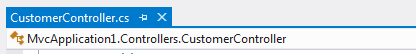
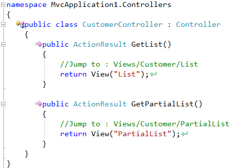
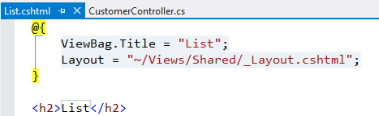
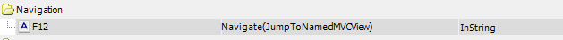
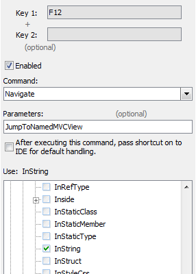

CR_JumpToNamedMVCView
=====================

**WARNING**: This plugin has been made obsolete by functionality built into CodeRush. As a result, no release is being made available for this plugin. The source will remain as an example of how to achieve this sort of functionality.

Purpose
=======
This plugin provides a new NavigationProider to help you navigate to a razor view from a controller that calls it by name.

Usage
=====

 * Start off in an MVC Controller

 * Place your caret on the name of the View being called 
 * Hit Ctrl+Alt+N

 * Choose Named MVC View
 * CodeRush transports you to the correct view.

Further Configuration
=====================

You want to, you could [bind this navigation directly to a keyboard shortcut](http://community.devexpress.com/blogs/rorybecker/archive/2010/10/05/binding-keys-in-coderush.aspx). 

I suggest the F12 key, since this functionality is akin to GotoDefinition.

Limitations
===========
This version of the navigation can only find Razor views. ie vbhtml or cshtml files.
